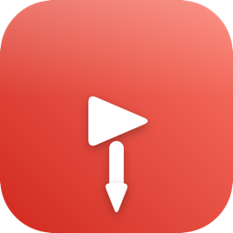
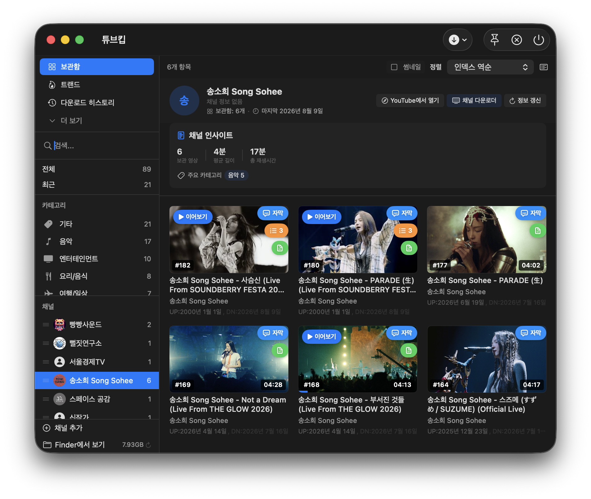
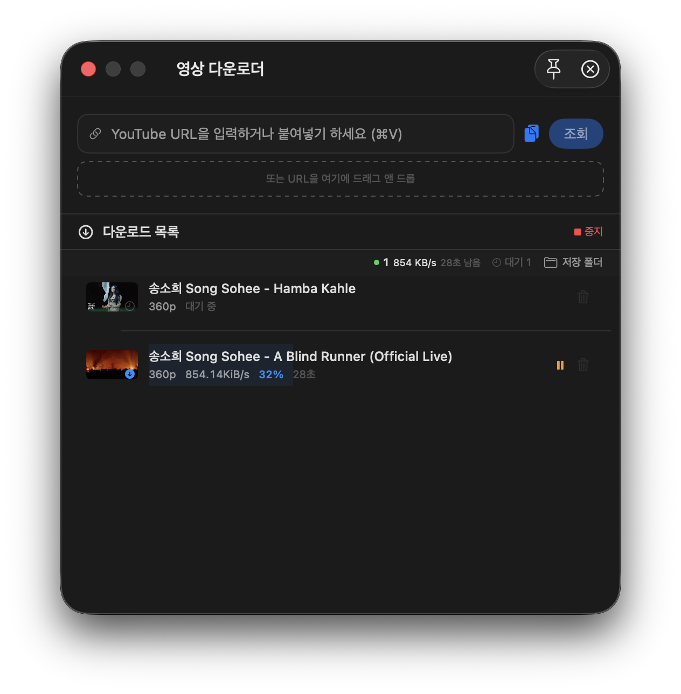
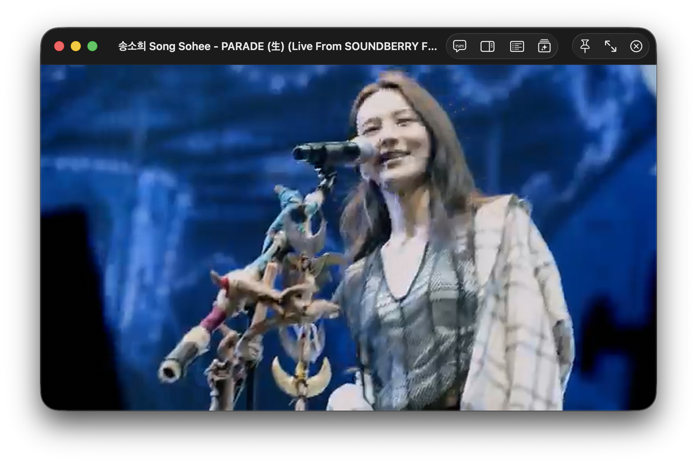

# 📺 TubeKeep (튜브킵)

> **macOS 전용 · YouTube 오프라인 라이브러리 + AI 통합 데스크톱 앱**
> 채널을 구독하듯 담고, 영상을 내 것으로. 그리고 AI가 비서처럼 정리해 줍니다.

<p align="center">
  
</p>

<p align="center">
  
</p>

---

## 🚀 한눈에 보기

| | |
|---|---|
| 🎬 **영상 다운로드** | yt-dlp 기반 안정적인 다운로드 · 큐 관리 · 재개 · 채널 일괄 |
| 🗂️ **보관함** | 그리드/목록 뷰, 검색·정렬·필터, 채널별 오프라인 라이브러리 |
| 🧠 **AI 요약 · Q&A · 마인드맵** | 자막 기반 영상 요약·챕터·대화·구조화 |
| 🎙️ **AI 팟캐스트** | 자막을 2인 대화형 팟캐스트로 자동 변환 |
| 🤖 **Whisper AI 자막** | 로컬 음성 인식으로 자막 없는 영상도 자동 자막 생성 |
| ▶️ **자체 플레이어** | H.264 최적화, 자막 오버레이, 이어보기, 트랜스코딩 캐시 |
| 📊 **채널 인사이트** | 태그·조회수·시청 시간 통계 요약 |
| 🕐 **유휴 자동화** | 잠자리 중 자동 자막/요약/팟캐스트 생성 |

> 다운로드가 실패해도 끝이 아닙니다. 임시파일(`.part`) 보존 → **자동 재개**,
> 실파일이 없는 "유령 완료"는 자동 감지해 **재다운로드 대기**로 전환합니다.

---

## 🖼️ 스크린샷

### 1. 메인 보관함 — 채널 · 영상 · AI 요약이 한 화면


### 2. 영상 다운로더 — URL / QR / 형식 선택 / 진행 큐



### 3. 자체 플레이어 — H.264 · 자막 오버레이 · 이어보기



---

## ⚙️ 설치 & 실행

```bash
# 1. 릴리스에서 최신 앱을 받거나 직접 빌드
./build_and_run.sh debug macos

# 2. (테스트) 유닛 테스트
swift test
```

**요구 사항**: macOS 14+ · Apple Silicon · Xcode Command Line Tools

---

## 🧩 기술 스택

- **언어/UI**: Swift · SwiftUI · TCA(Composable Architecture)
- **다운로드**: yt-dlp + ffmpeg(임베디드)
- **플레이어**: libmpv 임베디드 (H.264 최적화)
- **AI**: Gemini · OpenRouter · yTeaser 폴백 체인 · Whisper (로컬)

---

## 📚 문서

- [문서 가이드](docs/README.md) — 전체 인덱스
- [PRD](docs/PRD.md) · [DESIGN](docs/DESIGN.md) · [PLAN](docs/PLAN.md) · [TODO](docs/TODO.md) · [CHANGELOG](docs/CHANGELOG.md)

---

## 👤 정보

- **제작자**: BoRaSaRang
- **문의**: [leeborasarang@gmail.com](mailto:leeborasarang@gmail.com)
- **GitHub**: [BoraSarang/TubeKeep](https://github.com/BoraSarang/TubeKeep)

© 2026 BoRaSaRang. All rights reserved.